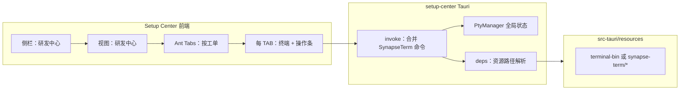

# 研发中心（SynapseTerm）迁入 Setup Center 方案

> 状态：**待评审**（部分条目已拍板，见下文「已确认决策」）。  
> 范围：在 `apps/setup-center` 增加「研发中心」菜单；按**工单**组织 TAB；将 `SynapseTerm/synapse-term` 的能力与资源合并进同一 Tauri 应用。

---

## 已确认决策（2026-03-26 补充）

1. **工单 TAB 数据**：首版使用 **MOCK 数据**；用户登录后由前端 **异步加载** 真实工单列表并替换/合并（接口形态实现阶段再定）。
2. **默认 `project_path`**：统一为**用户目录下**按工单隔离的路径：  
   - 记法：`~/.synapse/work/<工单ID>`  
   - Windows 实现对应：`%USERPROFILE%\.synapse\work\<工单ID>`（Rust/前端用 `dirs` / Tauri path API 解析 home，勿写死盘符）。  
   - 创建工单工作区目录的时机：首次「创建工作区」或 `create_agent_workspace` 前由应用 `create_dir_all` 保证存在。
3. **平台范围**：**仅 Windows**；macOS / Linux 上研发中心入口与相关 Rust 路径逻辑**首版不实现**（可隐藏菜单或编译 cfg 裁剪，实现时二选一）。
4. **`.gitignore`**：由仓库维护者**自行决定**；**本文档不写任何 `.gitignore` 条目建议**。

---

## 1. 背景与目标

### 1.1 背景

- `SynapseTerm/synapse-term` 是独立出来的终端 / psmux / 工单相关能力试验场，技术栈为 **Vite + 原生 TS + xterm.js + Tauri 2**，Rust 侧包含 `commands`、`deps`、`pty_manager`、`transcripts` 等模块。
- `openakita_jyhk/apps/setup-center` 是面向用户的主桌面应用（**React + Ant Design + Tauri 2**），已有大量 `invoke` 命令与安装器资源管线。

### 1.2 目标

1. 在 Setup Center **侧栏增加「研发中心」**，进入后使用 **TAB 页按工单** 展示（每个 TAB = 一个工单上下文，内嵌终端与相关操作区）。
2. 将 SynapseTerm 的**前端交互、Rust 命令、资源文件**迁入 Setup Center，保证 **dev / 打包 / 安装** 全链路可用。
3. 将原 `synapse-term/bin` 下的二进制与便携 PS7 等，**合并到** `apps/setup-center/src-tauri/resources`（或其后代目录），并**接入现有 `tauri.conf.json` bundle 与 `build.rs` 习惯**。

### 1.3 非目标（首版可明确砍掉或延后）

- 移动端 / Capacitor / 纯 Web 构建下提供完整 psmux 终端（PTY 与本地 exe 在浏览器中不可用，应**隐藏入口或降级提示**）。
- **非 Windows** 桌面：研发中心相关能力首版不做（见「已确认决策」）。
- 工单列表：首版 **MOCK**，登录后异步拉取真实数据；不要求首版即完成与后端工单 API 的完整联调（但前端需预留异步加载结构）。

---

## 2. 核心结论：是否合并到 `apps/setup-center`？

**建议：是。** 将 `SynapseTerm/synapse-term` **作为源码与资源迁入** `apps/setup-center`，而不是长期维持两个独立 Tauri 产品。

| 维度 | 合并到 setup-center | 维持双应用 + 进程间通信 |
|------|---------------------|-------------------------|
| 安装与更新 | 单一安装包、单一版本与 Updater | 需第二套安装程序或手动分发 |
| 权限与能力 | 一次配置 ACL / capabilities | 两套窗口与权限模型 |
| 用户体验 | 同一窗口侧栏切换 | 多窗口或跳转突兀 |
| 开发成本 | 一次合并工作量大，长期低 | 长期协议、调试成本高 |

独立仓库 `SynapseTerm` 可在合并完成后仅作**历史参考**或**最小可运行回归工程**（可选），避免与主产品分叉。

---

## 3. 现状摘要（便于评审对齐）

### 3.1 SynapseTerm 侧

- **前端**：`src/main.ts`、`src/terminal.ts`（xterm + `listen` 事件）、`src/style.css`、`index.html`。
- **Rust**：`lib.rs` 注册 `tauri_plugin_shell`、`PtyManager` 状态及一组 `invoke`（如 `pty_create_attach`、`create_agent_workspace`、`transcripts_*`、`agent_*` 等）。
- **依赖**：`portable-pty`、`tokio`、`zip`、`tauri-plugin-shell` 等（见 `synapse-term/src-tauri/Cargo.toml`）。
- **资源**（`tauri.conf.json`）：
  - `resources/tmux-windows-v3.6a-win32.7.zip`（zip 本体常因体积**未入库**，由 `src-tauri/resources/README.md` 说明下载来源）
  - `resources/agent-workspace.ps1`、`resources/synapse-term-agent-tmux.conf`
  - `../bin/psmux.exe`、`../bin/lazygit.exe`、`../bin/ps7` → 打包到 `resources/` 下同名路径
- **`deps.rs` 约定**：Windows 下通过 `BaseDirectory::Resource` 解析 `resources/psmux.exe` 等；`ps7` 与 `psmux` **同父目录**（`pty_manager` 内拼接 `psmux.exe` 同级的 `ps7` 注入 PATH）。

### 3.2 Setup Center 侧

- **前端**：`Sidebar.tsx` 中 `ViewId` 联合类型 + `App.tsx` 内 `view === "..."` 分支渲染；需在类型、侧栏、主内容三处扩展。
- **Rust**：`main.rs` 已存在大型 `invoke_handler` 列表；需**追加** SynapseTerm 命令并接入 `PtyManager` 等状态。
- **打包**：`tauri.conf.json` 的 `bundle.resources` 已为目录列表（如 `resources/synapse-server/`、`resources/claude-code-init/` 等）；`build.rs` 负责部分资源同步与预处理。

### 3.3 与「工单」的关系

SynapseTerm 原型里已有 **`work-order-key` 输入**，且 `create_agent_workspace`、`transcripts_start` 等命令已预留 `work_order_key: Option<String>`。研发中心 UI 应把「工单」提升为一等概念：**每个 TAB 绑定一个工单 ID**（及可选会话名等）；**默认工程路径**已定为 **`~/.synapse/work/<工单ID>`**（见「已确认决策」），避免多 TAB 共用一个输入框导致状态串扰。

---

## 4. 总体架构（评审版）



- **单进程单 WebView**：与现有一致；每个工单 TAB 内一个 xterm 实例，对应独立 `pty_create_attach` 返回的 `sessionId`（或按会话策略复用，见下文待确认项）。
- **Tauri 桌面 + 仅 Windows**：菜单与 `invoke` 能力仅在 **Windows 且 Tauri** 下启用；其他平台不展示或编译期排除。

---

## 5. 资源与 `bin` 迁移方案（对齐你的建议）

### 5.1 推荐目录布局

在 **`apps/setup-center/src-tauri/resources/`** 下新增专用子目录（名称二选一，实现时统一即可）：

- **方案 R1（推荐）**：`resources/synapse-term/`
  - `psmux.exe`、`lazygit.exe`
  - `ps7/`（整目录）
  - `tmux-windows-v3.6a-win32.7.zip`
  - `agent-workspace.ps1`、`synapse-term-agent-tmux.conf`

这样与现有 `resources/claude-code-init/` 等并列，语义清晰。

### 5.2 `tauri.conf.json` 配置

在 `bundle.resources` 中增加目录项，例如：

```json
"resources/synapse-term/"
```

（Tauri 2 对目录打包已有先例；需确认 Windows 安装程序对**大量小文件**（尤其 `ps7`）的性能与体积是否可接受。）

### 5.3 Rust 路径适配

当前 SynapseTerm 的 `deps.rs` 使用：

- `resources/psmux.exe`
- `resources/lazygit.exe`
- `resources/tmux-windows-v3.6a-win32.7.zip`
- `resources/agent-workspace.ps1`

迁入后应统一改为：

- `resources/synapse-term/psmux.exe`（等）

并相应调整 `pty_manager` 中 **PATH 里 `ps7` 目录** 的拼接逻辑（仍为 `psmux.exe` 父目录下的 `ps7` 子目录即可，与现逻辑一致）。

### 5.4 资源入库与构建补充说明

- **`.gitignore` 是否忽略 `synapse-term` 资源目录**：**不由本文档规定**，由维护者自行决定。
- 建议在 `resources/synapse-term/` 内保留 **`README.md`**（注明 `psmux`、`lazygit`、`ps7`、tmux zip 的版本与获取方式，可继承 SynapseTerm 仓库说明），便于开发者与 CI 对齐；是否提交大二进制文件以仓库策略为准。

**CI / 本地构建**（可选，评审可继续定夺）：

1. **文档 + 脚本**：例如 `scripts/fetch-synapse-term-assets.ps1` 从固定版本 URL 拉取（需注意许可证与供应链）。
2. **与 `build.rs` 对齐**：若仓库某路径存在则拷贝进 `resources/synapse-term/`（类似 `ensure_claude_bundle_from_repo` 模式）。

---

## 6. Rust 合并策略

### 6.1 代码组织

推荐 **拆模块** 而非把数千行粘进 `main.rs`：

- `src-tauri/src/rd_terminal/mod.rs`（或 `synapse_term/`）再分 `commands.rs`、`deps.rs`、`pty_manager.rs`、`transcripts.rs`
- `main.rs`：`mod rd_terminal;`、`.manage(PtyManager::new())`、`.plugin(tauri_plugin_shell::init())`（若与现有插件冲突需测顺序）、`generate_handler![..., rd_terminal::commands::...]`。  
  与「仅 Windows」一致：`PtyManager` 注册、`invoke` 中的终端相关命令、以及 `setup`/`Exit` 里 `taskkill psmux` 等，宜用 **`cfg(target_os = "windows")`** 包裹，非 Windows 构建不编译或 no-op。

### 6.2 依赖项

在 `apps/setup-center/src-tauri/Cargo.toml` 增加 SynapseTerm 所需 crate（`portable-pty`、`tokio` 等），版本与主工程统一约束，避免重复 `zip` 版本冲突（当前主工程已有 `zip`，以**合并 features** 为准）。

### 6.3 Capabilities

SynapseTerm `default.json` 含 `shell:allow-open`。Setup Center 需在 `capabilities/default.json` 中**按需增加** shell 相关权限，并执行 `tauri capability` 生成流程（若项目要求）。

### 6.4 生命周期

SynapseTerm 在 Windows 退出时会 `taskkill psmux.exe`。合并后需评估是否与用户其他 psmux 用途冲突；首版可保留行为，后续可加「仅杀本应用拉起」的优化（待确认）。

---

## 7. 前端合并策略（多方案对比）

### 方案 F1（推荐）：React 组件化迁移

- 新增依赖：`@xterm/xterm`、`@xterm/addon-fit`。
- 将 `TerminalSession` 从 class 改为 **React 封装**（`useRef` + `useEffect` 挂载/销毁，监听 `pty://data/${id}`）。
- 新增页面：`RdCenterView`（Ant Design `Tabs`），每个 `items` 对应一个工单配置；列表数据首版 **MOCK**，登录成功后 **异步加载** 替换（预留 `useEffect` / React Query 等钩子即可）。
- 样式：可将 `synapse-term/style.css` 中终端相关部分迁入 setup-center 的 CSS 模块或全局片段，**避免**与 Ant Design 全局冲突（建议 scoped 容器 class）。

**优点**：与主应用一致、易维护。  
**缺点**：需一次性把原型 DOM 按钮迁成 React 控件。

### 方案 F2：iframe 嵌入独立构建的 synapse-term `dist`

**不推荐**：双前端构建、消息桥、CSP、路径与 `invoke` 上下文复杂，长期债高。

### 方案 F3：Webview 二次加载本地 html

**不推荐**：Tauri 2 多 WebView 与事件总线成本高，且仍要解决 React 与静态页两套 UI。

**评审建议：采用 F1。**

---

## 8. 侧栏与路由扩展（实现清单级）

1. `Sidebar.tsx`：`ViewId` 增加例如 `"rd_center"`（或 `"dev_lab"`，命名评审定）。
2. `App.tsx`：`renderMainContent`（或等价分支）增加 `view === "rd_center"` → 渲染 `RdCenterView`。
3. `i18n/en.json`、`zh.json`：`sidebar.rdCenter` 等文案。
4. **平台门控**：**非 Tauri 或非 Windows** 不展示「研发中心」`navItem`（或点击后提示不可用）；与「已确认决策」一致。

---

## 9. 实施阶段建议

| 阶段 | 内容 | 验收 |
|------|------|------|
| P0 | 资源目录、`tauri.conf`、`deps` 路径、README（`.gitignore` 由维护者自定） | 本地 `tauri build` 能找到 `psmux.exe` |
| P1 | Rust 模块合并 + capabilities + `invoke` 全量注册（**Windows cfg**） | 最小 Demo：单 TAB 能 attach |
| P2 | React 研发中心 + MOCK 工单 TAB + 登录后异步加载占位；默认路径 `~/.synapse/work/<工单ID>` | 多 TAB 互不串 `sessionId` |
| P3 | 打磨：错误提示、会话命名与 transcripts 策略、与登录态联调 | 产品可试用 |

---

## 10. 待评审确认项（请产品 / 研发拍板）

以下条目**仍待**评审；已拍板项见文首「已确认决策」。

1. **tmux/psmux 会话命名规则**：是否按 `工单ID`（或 `work_order_key`）派生 session 名，避免与固定 `agent-dev` 冲突？多 TAB 是否一工单一会话？
2. **二进制许可证与分发**：`psmux`、`lazygit`、PS7、tmux zip 的再分发条款是否在法务允许范围内（需在 `README` 中注明来源与版本）。
3. **登录后工单 API**：URL、鉴权、分页与字段映射（实现异步加载时落地）。

---

## 11. 评审通过标准（Checklist）

- [ ] 确认采用 **F1 React 迁移** 与 **R1 `resources/synapse-term/`** 资源布局。
- [ ] 确认 **大文件 / 资源是否入库** 及获取方式（脚本 vs 内网制品库 vs 手动放置）——**与 `.gitignore` 策略解耦，由维护者自定**。
- [ ] 确认 **研发中心** 仅在 **Windows + Tauri 桌面** 展示。
- [ ] 确认工单 TAB 的 **最小数据模型**（字段：工单 ID、展示标题、可选会话名、`project_path` 默认 `~/.synapse/work/<工单ID>`、是否自动开 transcripts 等）；首版 **MOCK**，登录后 **异步加载**。
- [ ] 确认 `psmux` 退出策略是否接受全局 `taskkill`（或记录后续优化项）。

---

## 12. 参考路径（仓库内）

- SynapseTerm 工程根：`SynapseTerm/synapse-term/`
- Setup Center：`openakita_jyhk/apps/setup-center/`
- 现有侧栏视图类型：`apps/setup-center/src/components/Sidebar.tsx`（`ViewId`）
- 现有 `invoke` 注册：`apps/setup-center/src-tauri/src/main.rs`（`invoke_handler` 块）

---

*文档版本：2026-03-26（修订：补充已确认决策，移除 `.gitignore` 建议）— 实施以评审结论为准。*
